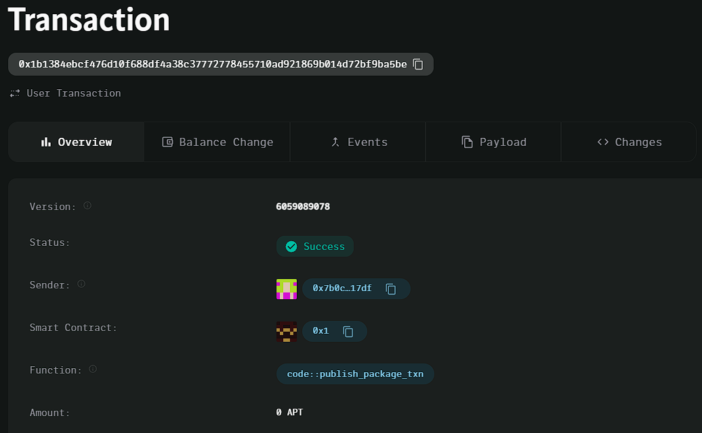

### Deployed smartcontract address: 0x1b1384ebcf476d10f688df4a38c37772778455710ad921869b014d72bf9ba5be

### Screenshot: 

# Project: Decentralized Messaging

## Project Description
A simple messaging app where messages are encrypted and sent between blockchain wallets.

## Vision
To provide a secure and decentralized communication platform where users can exchange encrypted messages without relying on third-party services.

## Key Features
- Send encrypted messages between wallet addresses.
- Retrieve the latest message for a recipient.

## Future Scope
- Implement message history tracking for users.
- Add message decryption features within the contract.
- Enable multiple message formats (text, media).
